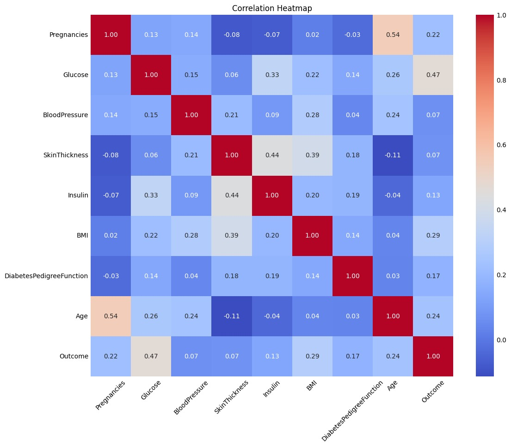
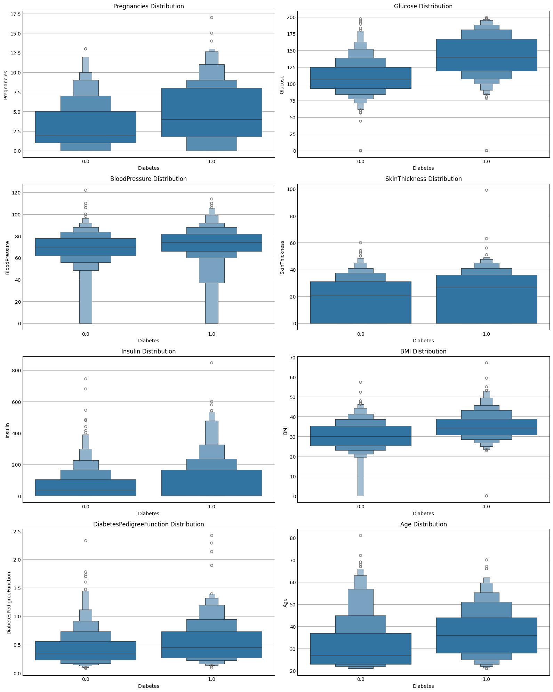
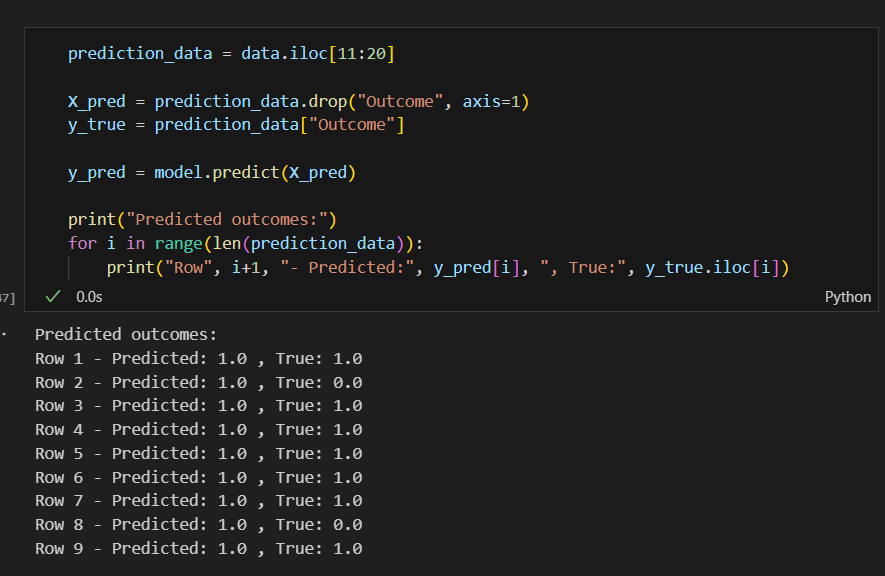
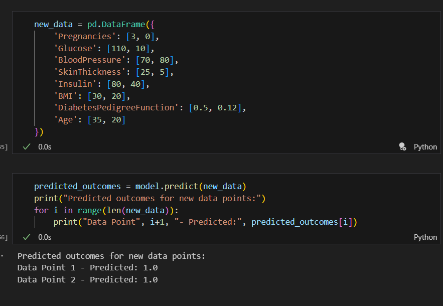

# Diabetes Data Analysis and Prediction
#    By Kusala Reddy, Siddhesh Panhalkar
## Introduction
### In this research, we create a prediction model to estimate the likelihood of getting diabetes. We use a large dataset and concentrate on important health markers to predict the onset of diabetes, such as blood pressure, BMI, and glucose levels.  To build a precise categorization system, our method combines preprocessing, machine learning, and data exploration. The approach assists healthcare providers with preemptive care methods in addition to identifying individuals who may be at danger. This documentation describes the steps involved in developing a trustworthy diabetes risk assessment tool, from the preliminary data analysis to the final model evaluation.
## Objective
### This project's main goal is to create and evaluate a predictive model that can precisely identify those who are at risk of getting diabetes in the following five years. This model seeks to improve early diagnosis and enable proactive treatment strategies by utilizing machine learning techniques and a dataset rich in pertinent health indicators, such as blood pressure, BMI, and glucose levels. By giving healthcare professionals a trustworthy tool to accurately identify and reduce diabetes risk, the project's ultimate goal is to enhance healthcare outcomes.
## Exploration of Dataset
### The project's dataset is made up of health-related and medical characteristics that people have provided in order to forecast when diabetes may manifest. Important characteristics consist of:
- ### Pregnancies: Number of times pregnant.
- ###  Glucose: Plasma glucose concentration a 2 hours in an oral glucose tolerance test.
- ### Blood Pressure: Diastolic blood pressure (mm Hg).
- ### Skin Thickness: Triceps skinfold thickness (mm).
- ### Insulin: 2-Hour serum insulin (mu U/ml).
- ### BMI: Body mass index (weight in kg/(height in m)^2).
- ### Diabetes Pedigree Function: A function which scores likelihood of diabetes based on family history.
- ### Age: Age in years.
### The target variable is a binary outcome indicating whether the individual developed diabetes within five years, labeled as ‘Positive’ or ‘Negative’. This dataset is crucial for training the predictive model, allowing it to learn from both the features and outcomes to make accurate predictions on new, unseen data.
## Understanding Data Types for Diabetes Prediction
### To predict diabetes effectively, our analysis relies on a variety of health indicators classified into different types of variables. These variables are essential in modeling as they provide the information needed to forecast diabetes onset.
### Types of Variables in the Dataset:

### 1. Categorical Variables:
- ### Outcome: Indicates the presence (1) or absence (0) of diabetes.
### 2.Numerical Variables:
- ### Pregnancies: Discrete, number of times pregnant.
- ### Glucose: Continuous, plasma glucose concentration.
- ### Blood Pressure: Continuous, diastolic blood pressure in mm Hg.
- ### Skin Thickness: Continuous, triceps skinfold thickness in mm.
- ### Insulin: Continuous, 2-hour serum insulin level in mu U/ml.
- ### BMI: Continuous, body mass index calculated as weight in kg divided by height in meters squared.
- ### Diabetes Pedigree Function: Continuous, a score that reflects diabetes risk based on family history.
- ### Age: Discrete, age in years.
## Process overview
- ### Data Acquisition and Loading:
### The dataset is loaded into a pandas DataFrame for manipulation and analysis. The file 'diabetes.csv' is read using pandas' read_csv function.
- ### Data Cleaning and Preprocessing:
### Initial data cleaning is performed to handle missing values by using the isnull function and filling or dropping these values where appropriate.
### Duplicates are checked with the duplicated function and handled to ensure the integrity of the dataset.
- ### Exploratory Data Analysis (EDA):
### Descriptive statistics are generated with the describe method, providing insights into central tendency, dispersion, and shape of the dataset’s distribution.
### Data visualization is performed using histograms to understand the distribution of each feature.
- ### Feature Engineering:
### Certain features with a high proportion of zeros are replaced with NaN values to avoid misleading the model, indicating that these are indeed missing or not observed values.
### Imputation of missing values is done by calculating the median and mean for different features to preserve the distribution of the data.
- ### Data Transformation:
### Normalization or standardization techniques are employed to scale numerical features using MinMaxScaler or StandardScaler from scikit-learn.
- ### Model Selection:
### Three different models are chosen for comparison to determine which best predicts diabetes onset. The models selected are Logistic Regression, known for its simplicity and efficiency in binary classification; Random Forest, for its robustness and ability to handle unbalanced data; and Decision Tree, for its interpretability and ease of use.
- ### Model Training:
### The dataset is split into training and test sets using train_test_split, reserving a portion of the data to evaluate model performance objectively.
### Each model is trained on the training set. Logistic Regression serves as a baseline with its linear approach. The Random Forest model is trained to exploit its ensemble learning technique, which improves prediction accuracy by reducing overfitting. The Decision Tree is trained to provide a clear decision path and understand the feature importance.
## Exploratory Data Analysis(EDA)
### Data Summarization:
- ### The initial step involves summarizing the data using methods like .info() to get an understanding of the dataset structure, such as the number of entries, non-null counts, and data types for each column.
- ### The .describe() method provides descriptive statistics for all numerical features, including mean, standard deviation, and the range of values, which help in understanding the distribution and central tendencies of the data.
### Here is the statistical Summary of the data 
| Feature | Count | Mean | Std | Min | 25% | 50% | 75% | Max |
|---------|-------|------|-----|-----|-----|-----|-----|-----|
| Pregnancies | 768.0 | 3.845052 | 3.369578 | 0.00 | 1.000000 | 3.000000 | 6.000000 | 17.00 |
| Glucose | 768.0 | 121.656250 | 30.438286 | 44.00 | 99.750000 | 117.000000 | 140.25000 | 199.00 |
| BloodPressure | 768.0 | 72.405184 | 12.096346 | 24.00 | 64.000000 | 72.202592 | 80.000000 | 122.00 |
| SkinThickness | 768.0 | 29.108073 | 8.791221 | 7.00 | 25.000000 | 29.000000 | 32.000000 | 99.00 |
| Insulin | 768.0 | 140.671875 | 86.383060 | 14.00 | 121.500000 | 125.000000 | 127.250000 | 846.00 |
| BMI | 768.0 | 32.457464 | 6.875151 | 18.20 | 27.500000 | 32.400000 | 36.600000 | 67.10 |
| DiabetesPedigreeFunction | 768.0 | 0.471876 | 0.331329 | 0.078 | 0.243750 | 0.372500 | 0.626250 | 2.42 |
| Age | 768.0 | 33.240885 | 11.760232 | 21.00 | 24.000000 | 29.000000 | 41.000000 | 81.00 |
| Outcome | 768.0 | 0.348958 | 0.476951 | 0.00 | 0.000000 | 0.000000 | 1.000000 | 1.00 |
## Variables
### X variables: These are the independent variables or features used to predict the outcome. They include all the fields in the dataset except for "Outcome." These typically consist of health measurements like glucose levels, blood pressure, skin thickness, insulin levels, BMI, age, and more.
### Y variable: The dependent variable, "Outcome," represents whether or not an individual has diabetes. This is what the model will predict based on the X variables.
### The problem is a classification type, meaning the goal is to categorize individuals into one of two classes: having diabetes (1) or not having diabetes (0).
### The dataset contains 768 observations, meaning there are 768 individual records to analyze and use for training and testing the model.
### Data Visualization:
### 1. Visualization techniques are applied to each feature to examine their distributions. Histograms and density plots are generated for variables like glucose levels, blood pressure, and BMI, which help in identifying the shape of the data distribution and any potential skewness or outliers.

### The visualizations presented appear to be histograms of the different variables from the diabetes dataset, each overlaid with a kernel density estimate (KDE) curve. Here's an interpretation for each plot:

- ### Pregnancies Distribution:
### The majority of observations have fewer than 5 pregnancies, with the distribution tailing off as the number of pregnancies increases. This indicates that higher numbers of pregnancies are less common in this dataset.
- ### Glucose Distribution:
### This appears to be normally distributed with a slight right skew. The bulk of the values center around the middle range, suggesting most individuals have glucose levels in a relatively normal range.
- ### Blood Pressure Distribution:
### Blood pressure values also show a roughly normal distribution, with most values clustering around the median. There's a slight right skew, suggesting a few individuals with higher blood pressure readings.
- ### Skin Thickness Distribution:
### The distribution of skin thickness is slightly right-skewed with many observations at the lower end, indicating many individuals have thinner skin folds, which could suggest lower body fat percentages.
- ### Insulin Distribution:
### Insulin levels have a right-skewed distribution, with a peak at the lower end and a long tail to the right. This could indicate that while most individuals have lower insulin levels, a significant number have high insulin levels, which might be associated with diabetes treatment or insulin resistance.
- ### BMI Distribution:
### The BMI histogram shows a distribution that is close to normal but with a right skew. This suggests the prevalence of higher BMI scores among participants, which is a known risk factor for diabetes.
- ### Diabetes Pedigree Function Distribution:
### This metric, which represents genetic influence on the likelihood of developing diabetes, is heavily right-skewed, indicating most individuals have a lower score but a few have significantly higher values, potentially indicating a strong genetic predisposition to diabetes.
- ### Age Distribution:
### The age distribution is somewhat right-skewed, showing that the dataset includes more younger individuals than older ones.
- ### Outcome Distribution:
### The outcome variable, which is binary, shows that there are more individuals without diabetes (0) than with diabetes (1) in this dataset.
### The KDE curves on top of the histograms provide a smooth estimate of the distribution, highlighting the central tendency and spread of each variable. These visualizations are critical for understanding the data's underlying patterns and informing the feature selection and modeling process in predicting diabetes.
### 2. A correlation matrix visualized through a heatmap is created to identify potential relationships between variables. This can highlight which features are most correlated with the outcome variable and with each other, providing insights that could be crucial for model feature selection.

### This figure demonstrates the correlation heatmap shows how different health indicators relate to each other and the likelihood of diabetes (Outcome). Glucose levels have the strongest positive correlation with diabetes outcomes, suggesting higher glucose levels increase the risk. Age and BMI are also positively correlated with the outcome, indicating an association with diabetes risk. Other variables show weaker relationships. Notably, many correlations are modest, highlighting a complex interplay of factors in diabetes risk.
## Distributions and Outliers

- ### Distribution of Pregnancies: Compared to people with diabetes (Diabetes 1), those without diabetes (Diabetes 0) had a lower median number of pregnancies. Non-diabetics had a less dispersed pattern, which suggests that they often have fewer pregnancies.
- ### dispersion of Glucose: The diabetic group has a significantly higher median glucose level with a wider dispersion, indicating a higher glucose level is linked to diabetes.
- ### Blood Pressure Distribution: The two groups' medians are comparable, but the distribution of blood pressure measurements is a little bit broader for those with diabetes, indicating a little bit more variation in those readings.
- ### Skin Thickness Distribution: The medians of the two groups are comparable, but the diabetic group's distribution is a little bit broader, suggesting that there is greater variation in skin thickness among those with diabetes.
- ### Insulin Distribution: The two groups' insulin levels are significantly different from one another, with the insulin levels of diabetics exhibiting a higher median and a wider spread.
- ### BMI Distribution: The distributions of BMI are wide for both groups, but the diabetic group has a higher median BMI, suggesting that people with diabetes typically have higher BMIs.
- ### DiabetesPedigreeFunction Distribution: A somewhat broader distribution and a higher median value for those with diabetes indicate that this function may be a useful marker of diabetes.
- ### Age dispersion: The diabetes group has a greater median age and a wider dispersion, suggesting that the frequency of diabetes rises with age.
### Feature Importance
### The feature importance in our project can be inferred from the correlation heatmap. Features with a stronger color intensity, be it red or blue, indicate a higher absolute value of correlation with the 'Outcome' variable and are thus considered more important in predicting diabetes.
- ### we are using all features for X, it's likely because each feature has shown some level of correlation with the 'Outcome' variable, as evidenced by the histograms and boxplots. The presence of data for each feature across different distributions suggests they may contribute unique information that could improve model performance.
### Feature engineering
### we handled missing values by treating zeros in certain features like 'Glucose', 'Insulin', 'SkinThickness', 'BloodPressure', and 'BMI' as missing values and imputing them. This approach suggests recognition of the fact that zeros in these clinical measurements are not plausible and thus represent missing data.
### Label Encoding vs One-Hot Encoding
### our project does not  require for  label encoding or one-hot encoding, as the features are numerical and not categorical.
## Model Fitting
```python 
X_train, X_test, y_train, y_test = train_test_split(X, y, test_size=0.2, random_state=42)
```
### We split the data into an 80/20 ratio for training and testing because it strikes a good balance. With 80% for training, our model has plenty of data to learn from. And by setting aside 20% for testing, we make sure we have a fair way to check how well the model will perform on new, unseen data. This split helps prevent our model from memorizing the training data too much (which is called overfitting) and gives us trustworthy results. It's a common approach in machine learning and strikes the right balance between training and testing.
### At first, there was a chance that our dataset may leak data because of missing values in characteristics like "Insulin" and "SkinThickness." But we've successfully reduced this risk by managing these missing values appropriately before dividing the data into training and testing groups.

### We've also taken action to completely eliminate any null or missing values from the dataset. This assures that our model will only learn from the training data and not accidentally access data from the testing set, thus reducing the possibility of data leaking.
### Models 
### Logistic regression 
### Logistic regression is a preferred method for binary classification tasks due to its interpretability and ability to provide probabilities of class membership.
```scaler = StandardScaler()
X_train_scaled = scaler.fit_transform(X_train)
X_test_scaled = scaler.transform(X_test)
model = LogisticRegression()
model.fit(X_train_scaled, y_train)
y_pred = model.predict(X_test_scaled)
accuracy = accuracy_score(y_test, y_pred)
print("Accuracy:", accuracy)
print(classification_report(y_test, y_pred))
```
### We opted to standardize our features using a scaler specifically for logistic regression. It's crucial because logistic regression performs better when all features are on the same scale. By standardizing them, we ensure that no single feature dominates the optimization process, leading to faster convergence. Plus, it maintains the interpretability of the coefficients while ensuring that regularization techniques are applied uniformly. Essentially, it's a standard preprocessing step that enhances the stability and performance of logistic regression models.
### Random Forest:
### Chosen for its capacity to manage high-dimensional datasets such as ours, it reduces overfitting and captures intricate correlations.
``` rf_model = RandomForestClassifier(n_estimators=100, random_state=42)
rf_model.fit(X_train, y_train)  
y_pred = rf_model.predict(X_test)
accuracy = accuracy_score(y_test, y_pred)
print("Accuracy:", accuracy)
print(classification_report(y_test, y_pred))
```
### Decision Tree:
### This tool is used to understand the factors impacting diabetes outcomes because of its intuitive character and simple interpretations.
```dt_model = DecisionTreeClassifier(random_state=42)
dt_model.fit(X_train, y_train)
y_pred = dt_model.predict(X_test)  
accuracy = accuracy_score(y_test, y_pred)
print("Accuracy:", accuracy)
print(classification_report(y_test, y_pred))
```
### "We don't typically standardize features for decision tree and random forest models. These algorithms work differently compared to logistic regression. See, decision trees and random forests base their splits on the relative ordering of features, not their actual values. So, whether a feature is on a different scale doesn't really matter—it's all about the relationships between them. Plus, these models are robust to outliers and can handle varying scales without a problem. And when it comes to interpreting the results, they're pretty straightforward already, so we don't need to mess with the feature scales to make them clearer."
## Validation / metrics
### Our evaluation focused on accuracy, recall, and precision metrics to assess the models' performance in predicting diabetes. Accuracy was prioritized for its ability to represent overall effectiveness, ranging from 72% to 76% across models. We also considered recall and precision to understand the models' ability to correctly identify positive cases and minimize false positives, respectively. This approach ensured a comprehensive evaluation, aiming for robust models capable of accurate diabetes prediction.
### Logistic Regression
#### Accuracy: 0.7532467532467533
#### 
|           | Precision | Recall | F1-score | Support |
|-----------|-----------|--------|----------|---------|
| 0.0       | 0.80      | 0.83   | 0.81     | 99      |
| 1.0       | 0.67      | 0.62   | 0.64     | 55      |
| Accuracy  |           |        | 0.75     | 154     |
| Macro avg | 0.73      | 0.72   | 0.73     | 154     |
| Weighted avg | 0.75   | 0.75   | 0.75     | 154     |

### Random Forest
#### Accuracy: 0.7597402597402597
####
|           | Precision | Recall | F1-score | Support |
|-----------|-----------|--------|----------|---------|
| 0.0       | 0.82      | 0.80   | 0.81     | 99      |
| 1.0       | 0.66      | 0.69   | 0.67     | 55      |
| Accuracy  |           |        | 0.76     | 154     |
| Macro avg | 0.74      | 0.74   | 0.74     | 154     |
| Weighted avg | 0.76   | 0.76   | 0.76     | 154     |
### Decision Tree
#### Accuracy: 0.7207792207792207
####
|           | Precision | Recall | F1-score | Support |
|-----------|-----------|--------|----------|---------|
| 0.0       | 0.79      | 0.77   | 0.78     | 99      |
| 1.0       | 0.60      | 0.64   | 0.62     | 55      |
| Accuracy  |           |        | 0.72     | 154     |
| Macro avg | 0.70      | 0.70   | 0.70     | 154     |
| Weighted avg | 0.72   | 0.72   | 0.72     | 154     |

### Among the models evaluated, the Random Forest Classifier exhibits the highest accuracy with approximately 75.97%, indicating it is the most precise model for the dataset used. Its balanced approach to handling the dataset's complexity likely contributes to this performance, despite the potential for overfitting that ensemble methods sometimes exhibit. On the other end, the Decision Tree Classifier has the lowest accuracy, around 72.08%, which may be due to its tendency to overfit the training data and not generalize well to new, unseen data. The Logistic Regression model sits in the middle, with an accuracy close to Random Forest at approximately 75.32%, offering a more straightforward and interpretable model but with slightly reduced predictive power compared to the Random Forest Classifier.
### Confusion Matrix
### The confusion matrix for both Logistic Regression and Random Forest models shows the counts of true positives, true negatives, false positives, and false negatives. This helps to understand the model's performance in detail beyond just accuracy, especially regarding how well the model distinguishes between the two classes.
 


### Confusion matrices provide a comprehensive breakdown of a classification model's performance. Each matrix consists of four components: True Positives (TP), True Negatives (TN), False Positives (FP), and False Negatives (FN).

### Logistic Regression Confusion Matrix:

### True Negative: 62
### False Positive: 17
### False Negative: 21
### True Positive: 34
### This model has a moderate number of false positives and false negatives, which could indicate that it does not distinctly separate the classes well.
### Random Forest Confusion Matrix:

### True Negative: 70
### False Positive: 20
### False Negative: 17
### True Positive: 38
### The Random Forest model has the highest number of correct predictions but also shows a tendency towards false positives.
### Decision Tree Confusion Matrix:

### True Negative: 76
### False Positive: 23
### False Negative: 20
### True Positive: 35
### While the Decision Tree has the highest true negatives, its relatively high false positives and false negatives suggest potential overfitting.
## Model Weaknesses:
### Logistic Regression:

### Model may struggle with complex, non-linear boundaries between classes.
### Misclassifications are roughly balanced between false positives and negatives, suggesting it may not be strongly biased toward one class but could still benefit from further tuning.
### Random Forest:

### Higher false positive rate may indicate that the model's classification threshold could be too aggressive or that it has not captured the nuances between the classes perfectly.
### May suffer from overfitting as ensemble methods can become overly complex.
### Decision Tree:

### The high number of false positives and negatives could be a sign of overfitting, meaning the model may not generalize well to new data.
### Decision trees are also sensitive to small changes in the data, which can lead to high variance in the model's predictions.
### 
### 
## Production
### In deploying our machine learning models for predicting diabetes, we've focused heavily on comprehensive testing prior to rollout, ensuring our models perform consistently across varied scenarios. Continuous performance monitoring is in place to catch and correct any drift in accuracy. We're acutely aware of the sensitivity of medical data, hence we've taken stringent measures to safeguard patient privacy and adhere to all relevant health regulations. Transparency is key, so our models are designed to provide clear, interpretable outputs for healthcare professionals. Recognizing that medical data evolves, we've established procedures for periodic model retraining to keep our predictions accurate and relevant, while actively working to prevent bias, ensuring our models serve all patient groups fairly.
## Going Further
- ### Collecting more data can help improve the model, especially if it includes underrepresented classes. 
- ### Further tune the model's hyperparameters to find a more optimal set of values.Combining multiple models to improve predictions.To enhance our diabetes prediction models, we're exploring avenues for incorporating more diverse and comprehensive data, which can help capture the nuances of the disease better. 
- ### We are also considering the addition of new features that could be indicative of diabetes risk, potentially identified through expert clinical insights. Data augmentation techniques are on our radar to synthetically expand our dataset, especially to better represent minority classes and prevent overfitting. 
- ### Moreover, we're looking at advanced machine learning techniques, including ensemble methods and personalized models that consider individual patient histories, which could improve the predictive power and reliability of our models. Continuous collaboration with medical professionals will guide these improvements to ensure clinical validity and utility.
